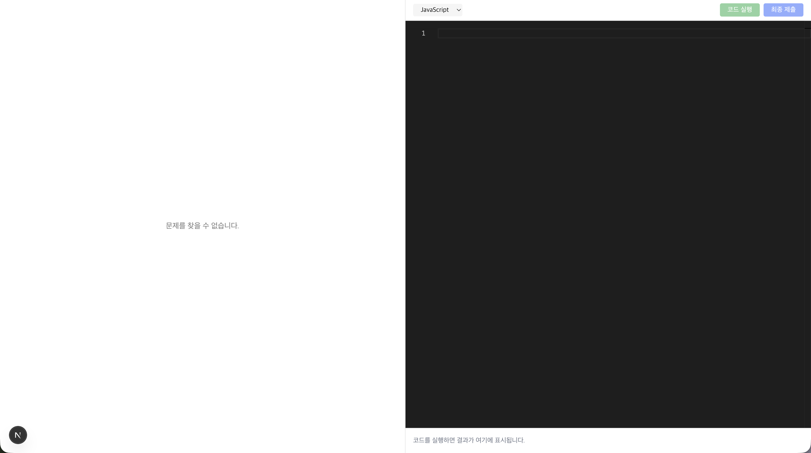
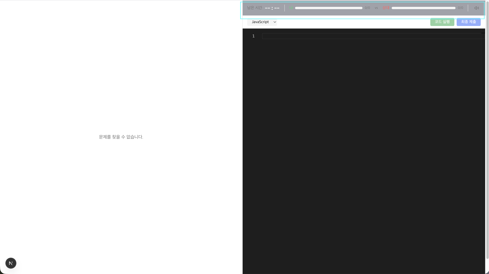
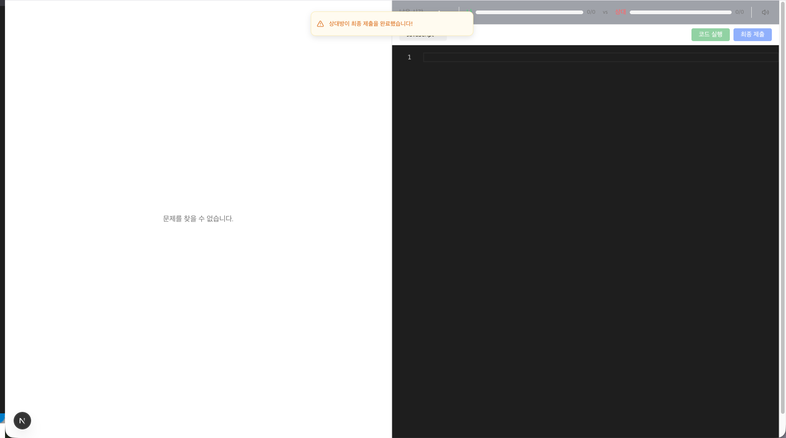

# ⚔️ Code Clash

> 실시간 1:1 알고리즘 대전 플랫폼



두 명의 플레이어가 같은 알고리즘 문제를 실시간으로 풀며 대결하는 웹 애플리케이션입니다.
제한 시간 내에 더 많은 테스트 케이스를 통과하는 사람이 승리합니다.

> 📅 **2026-05-10 기준** · Step 3 진행중 — 인증(OAuth)·친구 초대 매칭·매치 보안 완료, 프로필 페이지 남음

## 주요 기능

### 실시간 대전

- Supabase Realtime 기반 1:1 매치 (방 생성 → 참가 → 대전 → 결과)
- 15분 제한 타이머 및 자동 제출
- 실시간 진행률 HUD — 내 진행률과 상대 진행률을 상단 바에서 동시 확인



### 코드 에디터 & 채점

- Monaco Editor 기반 코드 작성 (JavaScript / Python)
- Judge0 CE API를 통한 자동 채점 (테스트케이스별 pass/fail 판정)
- 3초 Rate Limiting으로 과도한 채점 요청 방지

### 긴장감 UX

- 상대가 코드를 제출하면 토스트 알림으로 즉시 안내
- 사운드 피드백 — 제출, 상대 제출, 경고, 승리, 패배, 무승부
- 음소거 토글 지원



### 인증

- Supabase Auth 기반 OAuth 로그인 (Google / GitHub)
- SSR 라우트 가드 (`middleware.ts`) — 보호 prefix(`/play`, `/result`, `/dashboard`, `/profile/me`) 세션 검증
- 서버 사이드 `auth.getUser()` 검증 — 모든 API 라우트에 `requireUser` 401 가드 통일
- 친구 초대 매칭 시 RLS 좁힘 + invite token 검증으로 자리 양도 방지

### 친구 초대 매칭

- 대시보드(`/dashboard`)에서 초대 링크 발급 → 친구가 링크(`/invite/[token]`)로 입장 → 자동 매치 시작
- 호스트 대기 화면 + Supabase Realtime `postgres_changes`로 상대 입장 즉시 감지
- 초대 링크 만료(5분) 분기 + 정원 차면 입장 차단

## 기술 스택

| 분류         | 기술                                          |
| ------------ | --------------------------------------------- |
| Framework    | Next.js 16 (App Router)                       |
| Language     | TypeScript, React 19                          |
| Backend / DB | Supabase (PostgreSQL, Realtime, Auth, RLS)    |
| Auth         | Supabase Auth + OAuth (Google / GitHub)       |
| 상태 관리    | Zustand, TanStack React Query                 |
| 코드 에디터  | Monaco Editor (`@monaco-editor/react`)        |
| 채점 엔진    | Judge0 CE (RapidAPI)                          |
| 스타일링     | Tailwind CSS 4, shadcn/ui                     |
| 기타         | sonner (토스트), react-markdown, lucide-react |

## 시작하기

### 사전 요구사항

- Node.js 18+
- Supabase 프로젝트 (OAuth Provider — Google / GitHub 활성화)
- Judge0 CE API 키 ([RapidAPI](https://rapidapi.com/judge0-official/api/judge0-ce))

### 환경변수 설정

프로젝트 루트에 `.env.local` 파일을 생성합니다:

```env
# Supabase — OAuth Provider(Google/GitHub)는 Supabase 대시보드에서 활성화
NEXT_PUBLIC_SUPABASE_URL=your_supabase_url
NEXT_PUBLIC_SUPABASE_ANON_KEY=your_supabase_anon_key
SUPABASE_SERVICE_ROLE_KEY=your_service_role_key  # 서버 전용 — 히든 테스트 케이스 채점 + 매치 join API

# Judge0 CE (RapidAPI)
JUDGE0_API_URL=https://judge0-ce.p.rapidapi.com
JUDGE0_API_KEY=your_rapidapi_key
JUDGE0_API_HOST=judge0-ce.p.rapidapi.com
```

### 설치 및 실행

```bash
# 의존성 설치
npm install

# 개발 서버 실행
npm run dev
```

`http://localhost:3000`에서 접속할 수 있습니다.

### Supabase 설정

`supabase/migrations/` 폴더의 SQL 파일을 파일명 순서대로 Supabase 대시보드 SQL Editor에서 실행하면
스키마 + RLS 정책 + 시드 데이터(문제 9건 + 테스트 케이스 43건)가 적용됩니다.
OAuth Provider(Google / GitHub)는 Supabase 대시보드 → Authentication → Providers에서 활성화합니다.

## 프로젝트 구조

```
app/
├── (auth)/                  # 인증 라우트 그룹
│   ├── layout.tsx           #   풀스크린 레이아웃
│   └── login/               #   /login — OAuth 버튼 (Google / GitHub)
├── auth/callback/           # /auth/callback — OAuth 콜백 (exchangeCodeForSession)
├── (main)/
│   ├── play/[matchId]/      # 매치 플레이 페이지 (호스트 대기 / 참가 대기 / 게임)
│   ├── dashboard/           # 친구 초대 카드
│   ├── profile/[userId]/    # 프로필 (예정)
│   └── result/[matchId]/    # 결과 화면 (예정 — 현재 /play 인라인)
├── invite/[token]/          # 친구 초대 링크 진입 (비인증 허용)
├── api/
│   ├── judge/               # Judge0 코드 채점
│   ├── match/invite/        # 친구 초대 매치 생성 + 토큰 발급
│   ├── match/[matchId]/     # 참가(join), 제출(submit)
│   └── problems/            # 문제 목록 및 상세
├── features/
│   ├── editor/              # 코드 에디터 (Monaco)
│   ├── match/               # 매치 상태/실시간/타이머/사운드 훅
│   ├── problem/             # 문제 표시 (Markdown)
│   └── review/              # AI 리뷰 (예정)
├── shared/
│   ├── components/          # QueryProvider, AuthListener, UserMenu
│   ├── hooks/useAuth.ts     # 통합 인증 상태 (React Query)
│   ├── lib/
│   │   ├── auth/            # requireUser (API 401 가드), protectedPaths
│   │   └── supabase/        # client / server / service-role 클라이언트
│   └── stores/              # useSoundStore (Zustand)
└── middleware.ts            # 세션 쿠키 갱신 + 보호 prefix SSR 라우트 가드
```

## 개발 로드맵

- [x] **Step 0** — 프로젝트 환경 구축
- [x] **Step 1** — 핵심 대전 루프 (매치 생성/참가, 에디터, 채점, 실시간 동기화, 승패 판정)
- [x] **Step 2** — 긴장감 UX (타이머, HUD, 사운드, 토스트 알림)
- [ ] **Step 3** — 인증 + 친구 초대 매칭 + 프로필 (진행중)
  - ✅ Supabase Auth (Google / GitHub OAuth)
  - ✅ 친구 초대 링크 매칭 + 호스트 대기 화면 + 실시간 매치 상태 동기화
  - ✅ 매치 보안 강화 (RLS 좁힘 + invite token 검증 + service-role 분리)
  - ⏳ 프로필 페이지 (`/profile/[userId]`, `/profile/me`, 닉네임 편집) — 예정
- [ ] **Step 4** — 결과 + AI 리뷰 (Gemini 기반 코드 리뷰, 결과 화면 분리)
- [ ] **Step 5** — 커뮤니티 (자동 매칭 큐, 리더보드, MMR, AI 대전 상대)
